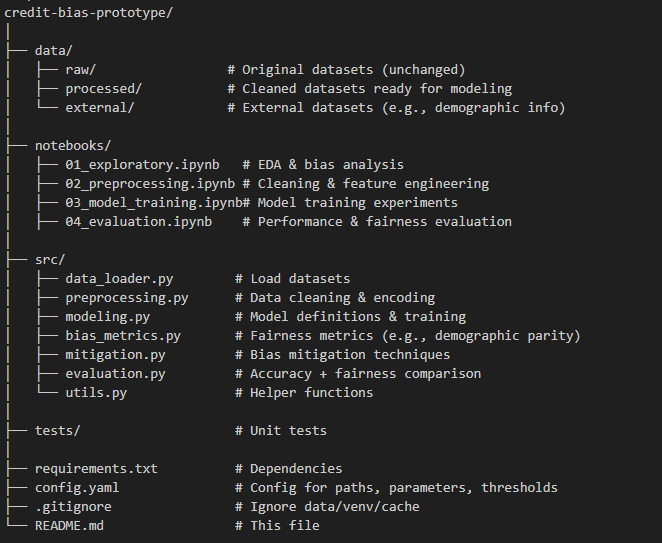

# 📊 Credit Scoring Bias Detection Prototype

## 📝 Overview
This project investigates **algorithmic bias** in credit scoring systems.  
We aim to:
1. Analyze dataset(s) for potential bias against protected groups (e.g., race, gender, age).
2. Train and evaluate machine learning models.
3. Measure **accuracy** and **fairness** metrics.
4. Apply **bias mitigation** techniques and compare results.

This repository contains:
- Data loading and preprocessing scripts.
- Notebooks for exploration, modeling, and evaluation.
- Utilities to measure and mitigate algorithmic bias.

The goal is to identify whether the credit scoring model disproportionately disadvantages certain groups and explore ways to improve fairness while maintaining predictive accuracy.

---

## ⚙️ Prerequisites
Before running the project, make sure you have:
- Python 3.10+
- pip or conda for package management
- Git
- Git Large File Storage (LFS) installed (for large datasets)
- Recommended: Virtual environment (venv or conda) to avoid dependency conflicts.

Install required Python packages:

```bash
pip install -r requirements.txt

---

## 📂 Project Structure


